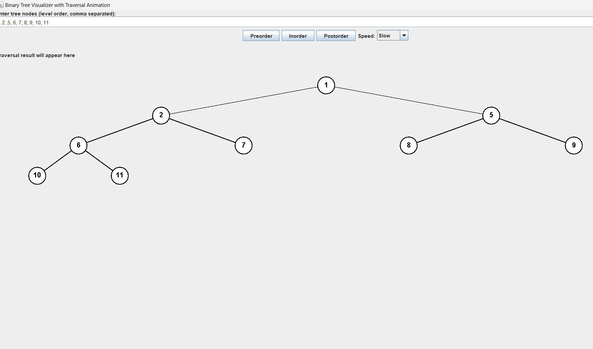
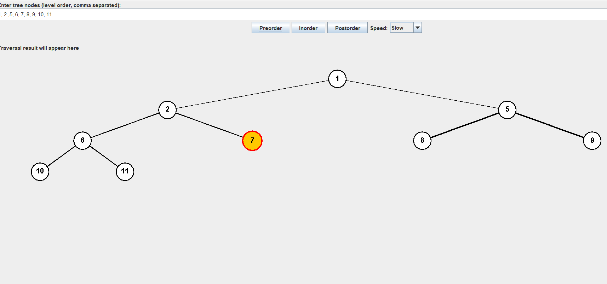

# 🌳 Binary Tree Visualizer with Traversal Animation

This is a Java Swing-based application that allows users to **visualize a binary tree** and **animate its traversals** (preorder, inorder, postorder). 

It’s designed to help students and beginners understand binary tree structures and traversal logic by showing how nodes are visited **step-by-step**.

---

## 📸 Screenshots

### 🖼️ Initial Tree View


### 🔄 Animated Traversal (e.g., Inorder)


> Place your screenshots inside the `/images` folder and ensure the filenames match (`screenshot1.png` and `screenshot2.png`).

---

## ✨ Features

- ✅ GUI-based input for binary tree values
- ✅ Visual rendering of the binary tree structure
- ✅ Buttons to perform:
  - Preorder traversal
  - Inorder traversal
  - Postorder traversal
- ✅ Animated traversal with arrow highlighting
- ✅ Adjustable animation speed (slow, medium, fast)
- ✅ Real-time display of the traversal order

---

## 🚀 How to Run

> **Requirements:**
> - Java 8 or above
> - Any Java IDE (e.g., VS Code, IntelliJ, Eclipse)

### 🛠️ Steps to Run

1. Clone the repository:
   ```bash
   git clone https://github.com/your-username/BinaryTreeVisualizer.git
   cd BinaryTreeVisualizer
